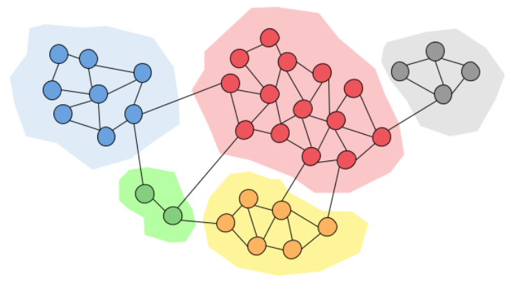

#### Authors: Yaoxin Li, Justin Nguyen, Vivek Rayalu

# Abstract
In this project, we explore the performance of three different approaches to community detection on the widely used CORA dataset and another Twitch Gamer Networks dataset. The CORA dataset represents a citation network of scientific papers in computer science and provides a challenging testbed for community detection algorithms, while the Twitch Gamer dataset represents the co-friend relationship between Twitch players. Our first approach uses a Multi-Layer Perceptron (MLP) that only considers node features to perform community detection. Our second approach uses another MLP that only considers graph data. Our third approach uses a graph neural network (GNN) that considers both node features and graph data. We evaluate the performance of the three models on the CORA dataset, comparing the results to ground-truth labels provided by the authors of the dataset. Our results show that the GNN model outperforms both the MLP models that only consider node features or graph data. This study highlights the importance of considering both, node features and graph data for community detection in complex networks, and highlights the potential of GNNs for this task. Our results have implications for future research in community detection and provide valuable insights for practitioners working with complex networks.

 

[CommunityDetection](https://towardsdatascience.com/community-detection-algorithms-9bd8951e7dae) by Thamindu Dilshan Jayawickrama
