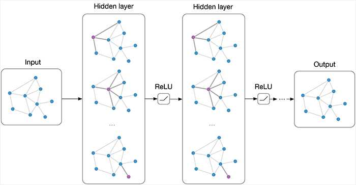

[MLP](https://www.tutorialspoint.com/tensorflow/tensorflow_multi_layer_perceptron_learning.htm) by TensorFlow

# MLP on Node Features

One of the neural networks we tested on the dataset was a Multi-Layer Perceptron constructed specifically to work with purely node features. The network consists of a linear layer that takes in the node feature matrix given by the dataset, ReLU activation, a second linear layer with 64 neural input and 32 output, fed into ReLU again, and finally a third linear layer with 32 neural input and output as the predicted community a node belongs to.

# MLP on Graph Data

The second MLP tested on the dataset was designed to operate solely based on graph data. This MLP was constructed similarly to the first MLP, with two linear layers and two ReLU layers, with the same sizes as well. The first linear layer was followed by a ReLU activation function, while the second linear layer had 64 input neurons and 32 output neurons, which were again fed into ReLU. The third linear layer, with 32 input neurons, produced the final prediction of the community that a node belongs to.

# GNN on Node Features + Graph Data

[GNN](https://theaisummer.com/Graph_Neural_Networks/) by Sergios Karagiannakos

This community detection algorithm is a graph convolutional neural network constructed to work with both node features and graph data. It is composed of a graph convolutional layer that takes as input the node feature matrix and edge indices with 64 output channels, followed by ReLU activation, and finally another graph convolutional layer with 64 input channels and output as the predicted community a node belongs to.