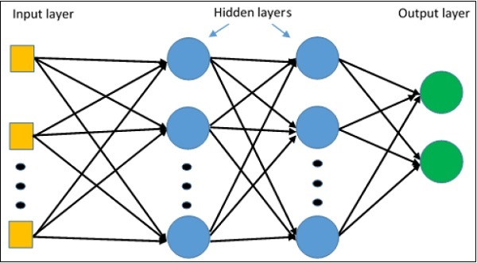

[MLP](https://www.tutorialspoint.com/tensorflow/tensorflow_multi_layer_perceptron_learning.htm) by TensorFlow

# MLP on Node Features

The first neural network we tested on the dataset was a Multi-Layer Perceptron constructed specifically to work with purely node features. This network architecture comprised three linear layers. The first layer accepted the node feature matrix provided by the dataset, followed by Rectified Linear Unit (ReLU) activation. The second layer comprised 64 neurons as input and 32 neurons as output, which were subsequently fed into another ReLU activation function. The third and final layer consisted of 32 neurons as both input and output, and it predicted which community a node belongs to.

# MLP on Graph Data

The second MLP tested on the dataset was designed to operate with a focus on graph data alone. This MLP architecture was constructed in a manner similar to the first MLP, with two linear layers and two ReLU layers of the same size. The first linear layer was followed by a ReLU activation function, while the second linear layer consisted of 64 input neurons and 32 output neurons that were subsequently fed into another ReLU layer. Finally, the third linear layer comprised 32 input neurons and generated the community prediction for a node. 

# GNN on Node Features + Graph Data

[GNN](https://theaisummer.com/Graph_Neural_Networks/) by Sergios Karagiannakos

For this community detection algorithm, we used a Graph Convolutional Neural Network constructed to take advantage of node features and graph data. The GCN architecture comprises a Graph Convolutional Layer that accepts the node feature matrix and edge indices as input and generates 64 output channels. This layer is subsequently followed by ReLU activation, and a second Graph Convolutional Layer with 64 input channels is employed to predict the community membership of each node. The output of this layer represents the final community prediction.
